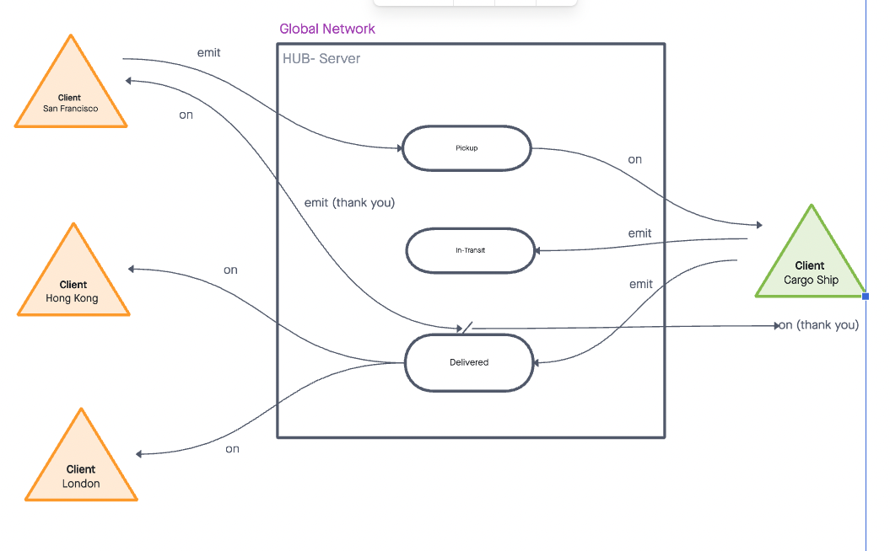

# LAB 14 Event Driven Applications

## Project: Port-to-Port

### Author: Marcus Hartwig & Simon Son

### Problem Domain

Create a new application using real-time events. Your team will be responsible for planning, executing, and presenting an application that showcases an event driven architecture.

### Links and Resources

* [GitHub](https://github.com/marcusdnhartwig/cargo-Lab14/pull/5)

### Setup

#### `.env` requirements (where applicable)

* PORT 3000

#### How to initialize/run your application (where applicable)

* node server.js
* node index.js

### Feature

#### The core functionality

* As a vendor(SF port) , I want to alert the system when I have a cargo to be picked up.
* As a cargo ship, I want to be notified when there is a cargo to be delivered.
* As a cargo ship, I want to alert the system when I have picked up a cargo and it is in transit.
* As a cargo ship, I want to alert the system when a cargo has been delivered.
* As a vendor(SF port), I want to be notified when a cargo has been delivered.
* As a client(HK port), I want to be notified when a cargo has been delivered.
* As a developer, I want to create network event driven system using Socket.io so that I can write code that responds to events originating from both servers and client applications.

#### UML Diagram

;
